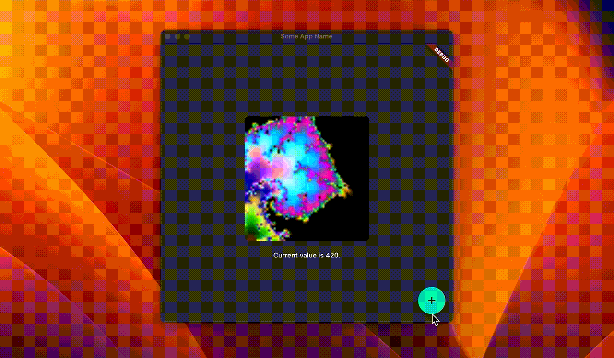

# 🆎 About This Template

> You can remove this section and `./readme` folder after you've created your repository.

This template provides instant capabilities to developers who want to embrace the power of **Rust** and **Flutter** together. Simply duplicate this template and you're ready to go!



Based on the default Flutter template, many popular packages and modifications are applied to make sure everything is super-ready. Future scalability and performance are taken into account.

Extra features added to the default Flutter template are:

- Rust integration with the ability to use an arbitrary number of library crates
- MVVM pattern with easy viewmodel binding from Dart and viewmodel update from Rust
- Convenient configuration management
- Preserving Rust logic on Dart's hot restart
- Convenient app naming and icon generation
- Setting desktop window properties

## Platform Support

Preparing a Flutter project targeting various platforms is not an easy task. It gets much harder when Rust is involved. With this template, you don't need to reinvent the wheel.

- Windows
- Linux
- Android
- macOS
- iOS

## Contribution

We love contributions! If you have any suggestions or want to report a bug, please leave it as an issue or a pull request. We will try to respond as quickly as possible.

The goal of this template is to enable the full power of Rust while using Flutter for front-end development. Rust code and Dart code should be detachable from each other.

# 🧱 Project Structure

**Flutter** deals with the cross-platform user interface while **Rust** handles the internal logic. The front-end and back-end are completely separated. These two worlds communicate through the viewmodel and task calls.

This repository is based on [Cunarist App Template](https://github.com/cunarist/app-template). It is possible to receive the latest commits from this template repository with the automated Python script written below.

# 👜 System Preparation

Flutter and Rust are required for building the app itself. Python is needed to automate complicated procedures. Git is responsible for version control and template update.

You can use an IDE of your choice. However, [Visual Studio Code](https://code.visualstudio.com/) is recommended because it has extensive support from Flutter and Rust communities.

## Preparing Git

Go to the [official downloads page](https://git-scm.com/downloads)

## Preparing Python

Download it from the app store if your system doesn't provide a pre-installed version. It's also available at [official downloads page](https://www.python.org/downloads/). Make sure `python` is available in the path environment variable.

## Preparing Rust

Refer to the [official docs](https://doc.rust-lang.org/book/ch01-01-installation.html).

## Preparing Flutter

Refer to the [official docs](https://docs.flutter.dev/get-started/install).

## System Verification

You can make sure your system is ready for development in the terminal.

```
git --version
python --version
rustc --version
flutter doctor
```

## Extra Steps

If you are targeting Android, macOS, or iOS, there are extra steps involved. Refer to [flutter_rust_bridge docs](https://cjycode.com/flutter_rust_bridge/template/setup.html) to install necessary components on your system.

# 🗃️ Setting Up

Install Dart packages written in `./pubspec.yaml` from [Pub](https://pub.dev/).

```
flutter pub get
```

Install Python packages written in `./requirements.txt` from [PyPI](https://pypi.org/).

```
pip install -r requirements.txt
```

Set the app name and domain. This only works once and you cannot revert this.

```
python automate app-naming
```

Apply `app_icon_full.png` file in `./assets` to multiple platforms with [Flutter Launcher Icons](https://pub.dev/packages/flutter_launcher_icons). Appropriate rounding and scaling are applied per platform with the power of Python. On Linux, you should include the icon manually in the distribution package.

```
python automate icon-gen
```

Apply `translations.csv` file in `./assets` to app profiles of multiple platforms. You need to run this extra command after changing the list of supported locales. Only modifying the CSV file is not enough on some platforms.

```
python automate translation
```

Receive the latest commits from [Cunarist App Template](https://github.com/cunarist/app-template).

```
python automate template-update
```

# 📝 Configuration Files

Before you proceed, you need to prepare files for system configuration.

This terminal command will generate configuration files or update them from template files if they already exist.

```
python automate config-filling
```

- File `./android/local.properties` contains information about the Android toolchain on the computer.
- File `./native/.cargo/config.toml` includes environment variables loaded in Rust. You might need them to provide external C++ library paths through environment variables for compilation with some third-party crates.
- There is no environment variable file for Dart. Use Dart's [hot reload](https://docs.flutter.dev/development/tools/hot-reload) feature instead. You might want to change variables directly in Dart to experiment with UI stuff such as dark mode.

Configuration files are not version-controlled. You should change fields inside these files during development to make things work on your computer. That information is only used in production and not included in the final release.

# 🍳 Actual Development

You might need to dive into this section quite often.

Check and fix problems in `./native` Rust code and `./lib` Dart code.

```
python automate code-quality
```

Check the actual sizes of compiled Rust libraries in release mode.

```
python automate size-check (platform)
```

Run the app in debug mode.

```
flutter run
```

Build the app in release mode.

```
flutter build (platform) --release
```

# ⛓️ MVVM Pattern

There are 3 layers of data flow.

1. View: Dart
1. Viewmodel: Bridge connecting Dart and Rust
1. Model: Rust

Rust logic updates the viewmodel. Dart listens to changes made in viewmodel and rebuilds the widgets accordingly. This system was designed to have minimal performance bottlenecks.

Suppose you have a Flutter widget inside a builder.

```dart
// ./lib/app.dart.

...
import 'bridge/wrapper.dart';
...

...
StreamBuilder<String>(
  stream: viewmodelUpdateBroadcaster.stream.where((itemAddress) {
    return itemAddress == 'someItemCategory.count';
  }),
  builder: (context, snapshot) {
    if (snapshot.hasData) {
      Map? jsonValue = readViewmodelAsJson(
        'someItemCategory.count',
      );
      String numberText = jsonValue?['value'].toString() ?? '??';
      return Text('counter.informationText'.tr(namedArgs: {
        'theValue': numberText,
      }));
    } else {
      return Text('counter.blankText'.tr());
    }
  },
)
...
```

`StreamBuilder` listens to a stream from `viewmodelUpdateBroadcaster` from `bridge/wrapper.dart` module. For better performance, it only listens to events with `itemAddress` of a specific value. In other words, the builder gets notified only when the viewmodel item that it is interested in is changed.

And then you have a Rust function.

```rust
// ./native/hub/sample_functions.rs

use crate::api::DotAddress;
use crate::bridge::update_viewmodel_with_json;
use crate::model;
use serde_json::json;

pub fn calculate_something(json_value: serde_json::Value) {
    let _ = json_value;

    let mut value = model::COUNT.write().unwrap();
    *value = sample_crate::add_seven(*value);
    println!("{:}", *value);
    let json_value = json!({ "value": *value });

    update_viewmodel_with_json(DotAddress::from("someItemCategory.count"), json_value)
}
...

```

You perform some calculations and perhaps interact with your custom data model. Then you update the viewmodel through `VIEWMODEL_UPDATE_SENDER` channel sender with `Vec<u8>` bytes data. Because Dart widgets are bound to viewmodel items, updating them will automatically trigger related widgets to be rebuilt.

By default, `json` is used to communicate between Dart and Rust. Although `json` has a bigger size compared to that of `protobuf` or `messagepack`, it has many advantages to be chosen. Thanks to extreme optimizations of `json` libraries of both Dart and Rust, its encoding and decoding performance is considerably faster than others. It also has highly readable syntax and its structure is very flexible. You can use it to pass basic texts or numbers as well as complex graph data, etc.

In Dart, you can use `readViewmodelAsJson` function from `bridge/wrapper.dart` module to read a viewmodel item. Type of the result value will be one of `Map`, `List`, `int`, `double`, `bool`, `String` and `null` depending on the structure you defined.

You can also use `readViewmodelAsBytes` function which returns `Uint8List` representing raw bytes of a viewmodel item. If the size of a viewmodel item is large, perhaps because it's a large-resolution image, you can pass in a value of true with `takeOwnership` argument to the function to avoid copying. Be aware that this action removes the item from the viewmodel.

Extra mechanisms such as calling a task from Dart can be found in the actual code. If there are things that are still unclear, feel free to leave a question or start a discussion.

Keep in mind that `lib.rs` inside `./native/hub/src` is the entry point of your Rust logic.

# 📜 Rules

## Allowed Modification

Be careful all the time! You shouldn't be editing any file without enough knowledge of how it works. Below are the top-level files and folders that are allowed to edit during app development:

- `lib`: Dart modules.
  - Do not modify the `bridge` folder inside.
- `pubspec.yaml`: Dart settings and dependencies.
- `assets`: Asset files.
- `native`: Rust crates. The name of the library crate folder should be the same as that of the library crate's name.
  - Think of `hub` crate as your Rust entry point. It is not a binary crate but it is similar.
  - Do not modify `bridge` module inside `hub` crate.
  - `config.toml.template` file is okay to be modified.

## Division of Functions

Dart should only be used for the front-end user interface and Rust should handle all other back-end logic such as file handling, event handling, timer repetition, calculation, network communication, etc. There can be an exception though if Rust or Dart has trouble dealing with multiple platforms on one's side.

If the characteristic of a specific Rust API is different from other Rust APIs, it should be detached into a separate Rust crate. All crates should provide a clean API with descriptive function names.

## User Interface Texts

Always write user interface texts in `./assets/translations.csv`.

When an app gains popularity, there comes a need to support multiple human languages. However, manually replacing thousands of text widgets in the user interface is not a trivial task. Therefore it is a must to write texts that will be presented to normal users in translation files.

Refer to [Easy Localization](https://pub.dev/packages/easy_localization) docs for more details.

## Comments

Please write kind and readable comments next to your code. You are probably not going to be developing on your own. Other developers should be able to get a grasp of the complex code that you wrote. Long and detailed comments are also welcomed.

## Python Automation Scripts

It is okay to rely on Python scripts in `./automate` for automation for faster and easier development.

# 📁 Folder Structure

Most of the top-level folders come from the default Flutter template.

- `windows`: Platform-specific files
- `linux`: Platform-specific files
- `macos`: Platform-specific files
- `android`: Platform-specific files
- `ios`: Platform-specific files
- `web`: Platform-specific files
- `lib`: Dart modules empowering the Flutter application.

However, there are some extra folders created in Cunarist App Template to integrate other elements into development.

- `automate`: Python scripts for automating the development process. These scripts have nothing to do with the actual build and don't get included in the app release. Only for developers.
- `native`: A workspace Rust crate that includes many other library crates. Each crate inside this folder gets compiled into a library file(`.dll`/`.so`). This means if there are 10 crates inside this folder, then there would be 10 library files next to the executable after compilation, each with a file name corresponding to their original crate.
- `assets`: A place for asset files such as images.

In addition, there might be some other temporary folders generated by tools or IDE you are using. Those should not be version-controlled.
