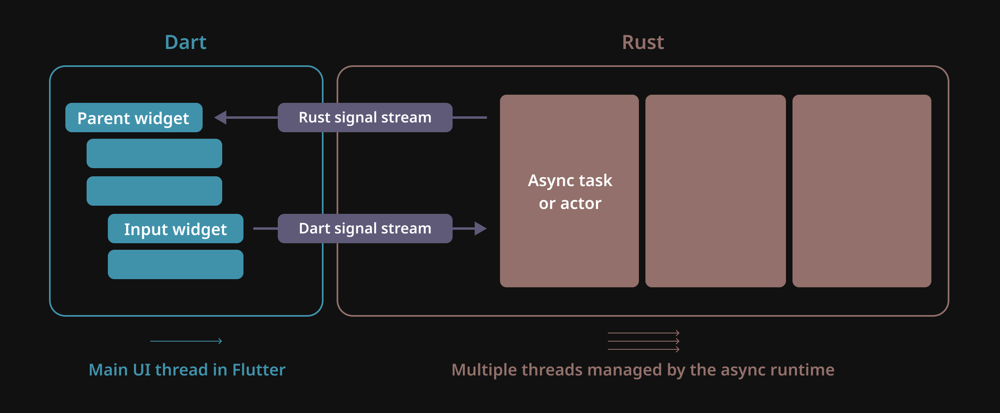

# Introduction

## About Rinf

Rinf enables building cross-platform Rust apps, combining it with Flutter's UI ecosystem.

```{eval-rst}
.. raw:: html
   :file: _templates/icon_pair.html
```

## Design

Rinf expects the entire business logic to be written in Rust, with Flutter only serving as the UI layer.[^1]

[^1]: If your business logic is written in Dart, Rinf may not be a suitable choice. Consider other solutions in such cases.



Rinf uses a two-way, stream-based message-passing mechanism instead of function calls. This decouples the business logic from the UI, ensuring a clear separation of concerns.

It is recommended to use the actor model on the Rust side and tree-based state management techniques such as `InheritedWidget` or `provider` in Flutter for efficient state propagation.

Actors in Rust should hold the state, while Flutter widgets receive only the view data needed to update the UI.

## Cross-Platform Compatibility

Rinf enables seamless development across major platforms:

- ✅ Linux: Tested and supported
- ✅ Android: Tested and supported
- ✅ Windows: Tested and supported
- ✅ macOS: Tested and supported
- ✅ iOS: Tested and supported
- ✅ Web: Tested and supported
